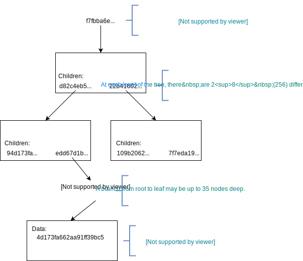
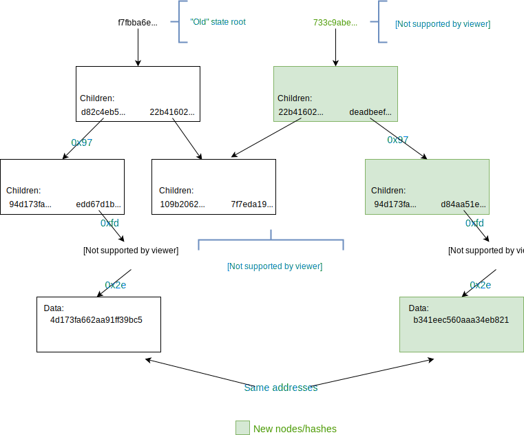

# Global State

One goal of a distributed ledger like Sawtooth, indeed the *defining*
goal, is to distribute a ledger among participating nodes. The ability
to ensure a consistent copy of data amongst nodes in Byzantine consensus
is one of the core strengths of blockchain technology.

Sawtooth represents state for all transaction families in a single
instance of a Merkle-Radix tree on each validator. The process of block
validation on each validator ensures that the same transactions result
in the same state transitions and that the resulting data is the same
for all participants in the network.

The state is split into namespaces which allow flexibility for
transaction family authors to define, share, and reuse global state data
between transaction processors.

## Merkle-Radix Tree Overview {#merkle-radix-overview-label}

<!--
  Licensed under Creative Commons Attribution 4.0 International License
  https://creativecommons.org/licenses/by/4.0/
-->

### Merkle Hashes

Sawtooth uses an addressable Merkle-Radix tree to store data for
transaction families. Let\'s break that down: The tree is a Merkle tree
because it is a copy-on-write data structure which stores successive
node hashes from leaf-to-root upon any changes to the tree. For a given
set of state transitions associated with a block, we can generate a
single root hash which points to that *version* of the tree. By placing
this state root hash on the block header, we can gain consensus on the
expected version of state *in addition to* the consensus on the chain of
blocks. If a validator\'s state transitions for a block result in a
different hash, the block is not considered valid. For more information
about general concepts, see the
[Merkle](https://en.wikipedia.org/wiki/Merkle_tree) page on Wikipedia.

### Radix Addresses

The tree is an addressable Radix tree because addresses uniquely
identify the paths to leaf nodes in the tree where information is
stored. An address is a hex-encoded 70 character string representing 35
bytes. In the tree implementation, each byte is a Radix path segment
which identifies the next node in the path to the leaf containing the
data associated with the address. The address format contains a 3 byte
(6 hex character) namespace prefix which provides 2^24^ (16,777,216)
possible different namespaces in a given instance of Sawtooth. The
remaining 32 bytes (64 hex characters) are encoded based on the
specifications of the designer of the namespace, and may include schemes
for subdividing further, distinguishing object types, and mapping
domain-specific unique identifiers into portions of the address. For
more information about general concepts, see the
[Radix](https://en.wikipedia.org/wiki/Radix_tree) page on Wikipedia.

## Serialization Concerns

In addition to questions regarding the encoding of addresses, namespace
designers also need to define the mechanism of serialization and the
rules for serializing/deserializing the data stored at addresses. The
domain-specific Transaction Processor makes get(address) and
set(address, data) calls against a version of state that the validator
provides. get(address) returns the byte array found at that address and
set(address, data) sets the byte array stored at that address. The byte
array is opaque to the core system. It only has meaning when
deserialized by a domain-specific component based on the rules of the
namespace. It is critical to select a serialization scheme which is
deterministic across executions of the transaction, across platforms,
and across versions of the serialization framework. Data structures
which don\'t enforce ordered serialization (e.g. sets, maps, dicts)
should be avoided. The requirement is to consistently produce the same
byte array across space and time. If the same byte array is not
produced, the leaf node hash containing the data will differ, as will
every parent node back to the root. This will result in transactions and
the blocks that contain them being considered valid on some validators
and invalid on others, depending on the non-deterministic behavior. This
is considered bad form.
